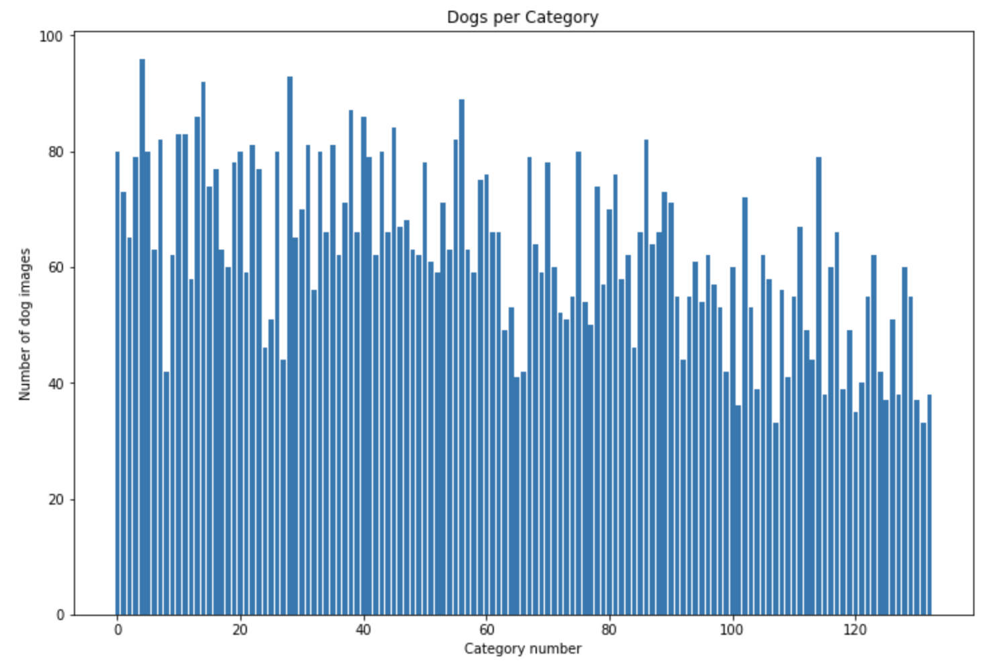

# Dog Breed Classifier with Deep Learning

## Introduction

This project is about preparing a classifier allowing dogs and humans recognition. Given an image of a dog, the algorithm will identify an estimate of the dog's breed. If supplied an image of a human, the code will identify the resembling dog breed.

We will define and train a Convolutional Neural Network  (CNN) using transfer learning, a technique that allows a model developed for a task to be reused as the starting point for another task. CNN network architecture is a specialized setup of interconnected neural network layers used in visal data analysis. CNN model typically consists of convolutional layers, activation function, pooling layers, fully connected layers and normalization layers.

This project is part of XXXXXXXX udacity XXXXXXXX

![Sample Output][images/sample_dog_output.png]


## Objective

The objective of this project is simply trainining an image classifier to recognize different breeds of dogs, then export it for use in a stand alone application.

We will piece together a series of models to perform different tasks; for instance, the algorithm that detects humans in an image will be different from the CNN that infers dog breed. 

The purpose of this article is descibe technical steps and their outcome from start to finish.

## Project Instructions

In order to setup everything to get started, follow [the Project Instructions](README.md).

## Approach

The approach we will take to fulfill our objective can be represented by the following list of steps:

- Step 1: Import Datasets
- Step 2: Detect Humans
- Step 3: Detect Dogs
- Step 4: Create a CNN to Classify Dog Breeds (baseline)
- Step 5: Use a CNN to Classify Dog Breeds (using Transfer Learning)
- Step 6: Create a CNN to Classify Dog Breeds (using Transfer Learning)
- Step 7: Write your Algorithm
- Step 8: Test Your Algorithm

## Step 1: Import Datasets

The first step is importing dog and human images datasets. We populate a few variables through the use of the load_files function from the scikit-learn library:

- `train_files`, `valid_files`, `test_files` - numpy arrays containing file paths to images
- `train_targets`, `valid_targets`, `test_targets` - numpy arrays containing onehot-encoded classification labels
- `dog_names` - list of string-valued dog breed names for translating labels

There are 8351 total dog images in 133 breed categories. For modeling purposes, the dataset is divided into sub-datasets:
 
- training (6680 dog images).
- validation (835 dog images).
- test (836 dog images).

There are 33 to 96 dog images in each category with the mean of 63 dog images per category.



The imported dataset of paths to human images, are stored in the numpy array `human_files`.

## Step 2: Detect Humans

Once the datasets are ready, we can focus on a function to detect whether a human face exists in an image. We use OpenCV's implementation of Haar feature-based cascade classifiers to detect human faces in images. OpenCV provides many pre-trained face detectors, stored as XML files on github. We have downloaded one of these detectors and stored it in the haarcascades directory.

```
import cv2                                              

# extract pre-trained face detector
face_cascade = cv2.CascadeClassifier('haarcascades/haarcascade_frontalface_alt.xml')

# load color (BGR) image
img = cv2.imread(human_files[30])

# convert BGR image to grayscale
gray = cv2.cvtColor(img, cv2.COLOR_BGR2GRAY)

# find faces in image
faces = face_cascade.detectMultiScale(gray)

# print number of faces detected in the image
print('Number of faces detected:', len(faces))

# get bounding box for each detected face
for (x,y,w,h) in faces:
    # add bounding box to color image
    cv2.rectangle(img,(x,y),(x+w,y+h),(255,0,0),2)
    
# convert BGR image to RGB for plotting
cv_rgb = cv2.cvtColor(img, cv2.COLOR_BGR2RGB)

# display the image, along with bounding box
plt.imshow(cv_rgb)
plt.show()

```

![Face detected][images/facedetected.png]

Before using any of the face detectors, it is standard procedure to convert the images to grayscale. The `detectMultiScale` function executes the classifier stored in `face_cascade` and takes the grayscale image as a parameter.

In the above code, `faces` is a numpy array of detected faces, where each row corresponds to a detected face. Each detected face is a 1D array with four entries that specifies the bounding box of the detected face. The first two entries in the array (extracted in the above code as `x` and `y`) specify the horizontal and vertical positions of the top left corner of the bounding box. The last two entries in the array (extracted here as `w` and `h`) specify the width and height of the box.

We can use this procedure to write a function that returns `True` if a human face is detected in an image or `False` otherwise. This function, aptly named `face_detector`, takes a string-valued file path to an image as input and appears in the code block below.

```
# returns "True" if face is detected in image stored at img_path
def face_detector(img_path):
    img = cv2.imread(img_path)
    gray = cv2.cvtColor(img, cv2.COLOR_BGR2GRAY)
    faces = face_cascade.detectMultiScale(gray)
    return len(faces) > 0

```
The function, tested on 100 human and 100 dog images, recognized 100% human faces in images comming from humans dataset and wrongly 11% human faces in images comming from the dog dataset (this number should be 0%).

Although not explicitely needed in our example, we could improve human faces recognition by adding more pictures as a result of visual transformations of the core dataset to make sure our dataset can cover some 'non standard' face presentations (like skewed ones, etc.).

## Step 3: Detect Dogs

A pre-trained ResNet-50 model was used to detect dogs in images. 

```
from keras.applications.resnet50 import ResNet50

# define ResNet50 model
ResNet50_model = ResNet50(weights='imagenet')

```

Our first line of code downloads the ResNet-50 model, along with weights that have been trained on ImageNet, a very large, very popular dataset used for image classification and other vision tasks. ImageNet contains over 10 million URLs, each linking to an image containing an object from one of 1000 categories. Given an image, this pre-trained ResNet-50 model returns a prediction (derived from the available categories in ImageNet) for the object that is contained in the image.

When using TensorFlow as backend, Keras CNNs require a 4D array (which we'll also refer to as a 4D tensor) as input, with shape (nb_samples,rows,columns,channels),  
where nb_samples corresponds to the total number of images (or samples), and rows, columns, and channels correspond to the number of rows, columns, and channels for each image, respectively.

The `path_to_tensor` function below takes a string-valued file path to a color image as input and returns a 4D tensor suitable for supplying to a Keras CNN.

```
from keras.preprocessing import image                  
from tqdm import tqdm

def path_to_tensor(img_path):
    # loads RGB image as PIL.Image.Image type
    img = image.load_img(img_path, target_size=(224, 224))
    # convert PIL.Image.Image type to 3D tensor with shape (224, 224, 3)
    x = image.img_to_array(img)
    # convert 3D tensor to 4D tensor with shape (1, 224, 224, 3) and return 4D tensor
    return np.expand_dims(x, axis=0)

```
The `paths_to_tensor `function takes a numpy array of string-valued image paths as input and returns a 4D tensor with shape (nb_samples,224,224,3).
 
Here, `nb_samples` is the number of samples, or number of images, in the supplied array of image paths. 

```
def paths_to_tensor(img_paths):
    list_of_tensors = [path_to_tensor(img_path) for img_path in tqdm(img_paths)]
    return np.vstack(list_of_tensors)

```

The `ResNet50_predict_labels` function makes predictions with ResNet-50.

```
from keras.applications.resnet50 import preprocess_input, decode_predictions

def ResNet50_predict_labels(img_path):
    # returns prediction vector for image located at img_path
    img = preprocess_input(path_to_tensor(img_path))
    return np.argmax(ResNet50_model.predict(img))

```

Getting the 4D tensor ready for ResNet-50, and for any other pre-trained model in Keras, requires some additional processing. First, the RGB image is converted to BGR by reordering the channels. All pre-trained models have the additional normalization step that the mean pixel (expressed in RGB as [103.939,116.779,123.68] and calculated from all pixels in all images in ImageNet) must be subtracted from every pixel in each image. This is implemented in the imported function `preprocess_input`. 

Now that we have a way to format our image for supplying to ResNet-50, we are now ready to use the model to extract the predictions. This is accomplished with the `predict` method, which returns an array whose  i-th entry is the model's predicted probability that the image belongs to the  i-th ImageNet category.

By taking the `argmax` of the predicted probability vector, we obtain an integer corresponding to the model's predicted object class, which we can identify with an object category through the use of [this dictionary](https://gist.github.com/yrevar/942d3a0ac09ec9e5eb3a).

While looking at the dictionary, we can notice that the categories corresponding to dogs appear in an uninterrupted sequence and correspond to dictionary keys 151-268, inclusive, to include all categories from 'Chihuahua' to 'Mexican hairless'. Thus, in order to check to see if an image is predicted to contain a dog by the pre-trained ResNet-50 model, we need only check if the `ResNet50_predict_labels` function above returns a value between 151 and 268 (inclusive).

We use these ideas to complete the `dog_detector` function below, which returns `True` if a dog is detected in an image (or `False` if not).

```
### returns "True" if a dog is detected in the image stored at img_path
def dog_detector(img_path):
    prediction = ResNet50_predict_labels(img_path)
    return ((prediction <= 268) & (prediction >= 151)) 

```

The code below tests the performance of your `dog_detector` function.

```
detected_human_faces = 0
detected_dog_faces = 0

for i in range(100):
    if dog_detector(human_files_short[i]):
        detected_human_faces += 1
    if dog_detector(dog_files_short[i]):
        detected_dog_faces +=1

```
The dog detector's performance is better as it identifies 0 dogs in human dataset and 100% dogs in the dog dataset.

## Step 4: Create a CNN to Classify Dog Breeds 


(fromScratch - define a baseline)

CNN to Classify Dog Breeds using Transfer Learning
The full dataset has 8,351 dog images, which is not large enough to train a deep learning model from scratch. Therefore, transfer learning with VGG-19 ( a convolutional neural network that is trained on more than a million images from the ImageNet database) is used to achieve relatively good accuracy with less training time.

Bottleneck Features
The bottleneck features for the VGG-19 network were pre-computed by Udacity, and then imported for later use by the transfer learning model.


Model Architecture
The last convolutional output of VGG-19 is fed as input to the model. We only need to add a global average pooling layer and fully connected layers as dog classifiers.

I added two fully connected layers for better accuracy, and a dropout layer to prevent over-fitting.


Below is my model architecture:


Model Metric
Accuracy is chosen as the metric to evaluate the model performance. Since data is just slightly imbalanced, accuracy should be a proper metric to select a good model.


Train Model
The model is trained using the pre-computed bottleneck features as input. A model check pointer is used to keep track of the weights for best validation loss. When all epochs are finished, the model weights with the best validation loss are loaded into the VGG19_model, which will be used later for predictions.


Make Predictions
Finally, it is ready to make predictions. The VGG19_predict_breed function takes an image path as input, and returns the predicted dog breeds. The dog_breed_pred function is built on the previous one, and returns predicted results depending on whether a dog or a human is detected in the input image.


Results
The accuracy of the final model on test dataset is about 73%, which is not bad. Originally, I trained a CNN model from scratch without using Transfer Learning, the accuracy was only 1.55%. Then, I created a CNN model using transfer learning and VGG-19 with only one fully connected layer, and was able to reach an accuracy of about 53%. Finally, I added a second fully connected layer to the classifier, and was able to achieve 73% accuracy.

When given an image of a dog, the final model predicts the dog breed. For example,


If a human is in the input image, it identifies the most resembling dog breed based on the person’s face.


Below is a picture of Basenji dog I found online. Does it look somewhat similar to the person above?


Image Source: https://www.akc.org/dog-breeds/basenji/
When the image does not contain a human or a dog, it will tell you that there is no human or dog detected. For example, if I provide a cat picture to the model, it does not try to predict its breed, which is expected.


Conclusion
Thanks to the transfer learning technique, I was able to train a model with relatively small dataset, and achieved pretty good accuracy. In addition, the model was trained within a short period of time, which is quite efficient. The main reason is we can reuse the weights trained by machine learning experts using millions of images.

The initial model was a CNN from scratch, which did not work well. It only reached an accuracy of 1.55%, slight better than random guess. I think it is because the size of dataset is relatively small, and the model architecture might not be well designed.

There are a few possible improvements for the model. First, the parameters of fully connected layers, such as number of layers, number of nodes, dropout percentages, might be tweaked to get better results. Second, using a different optimizer or evaluation metric may also improve model performance. Third, data augmentation could also improve the final model accuracy, as it will generate more training data.

Machine LearningTransfer LearningImage RecognitionData ScienceDeep Learning
Go to the profile of Shuo Wang
Shuo Wang
Related reads
Kuzushiji-MNIST - Japanese Literature Alternative Dataset for Deep Learning Tasks
Go to the profile of Rani Horev
Rani Horev
Dec 14, 2018
Related reads
A Beginner’s Tutorial on Building an AI Image Classifier using PyTorch
Go to the profile of Alexander Wu
Alexander Wu
Feb 4
Related reads
Build a simple Image Retrieval System with an Autoencoder
Go to the profile of Nathan Hubens
Nathan Hubens
Aug 24, 2018
Responses
Conversation with Shuo Wang.
Go to the profile of Niteesh Kanungo
Niteesh Kanungo
Jan 8
Can you please share the weights and the source code link?

Go to the profile of Shuo Wang
Shuo Wang
Jan 9
Hi, this is my github: https://github.com/swang13/dog-breeds-classification


