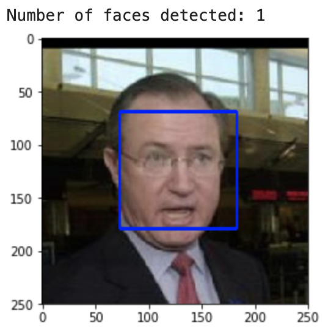
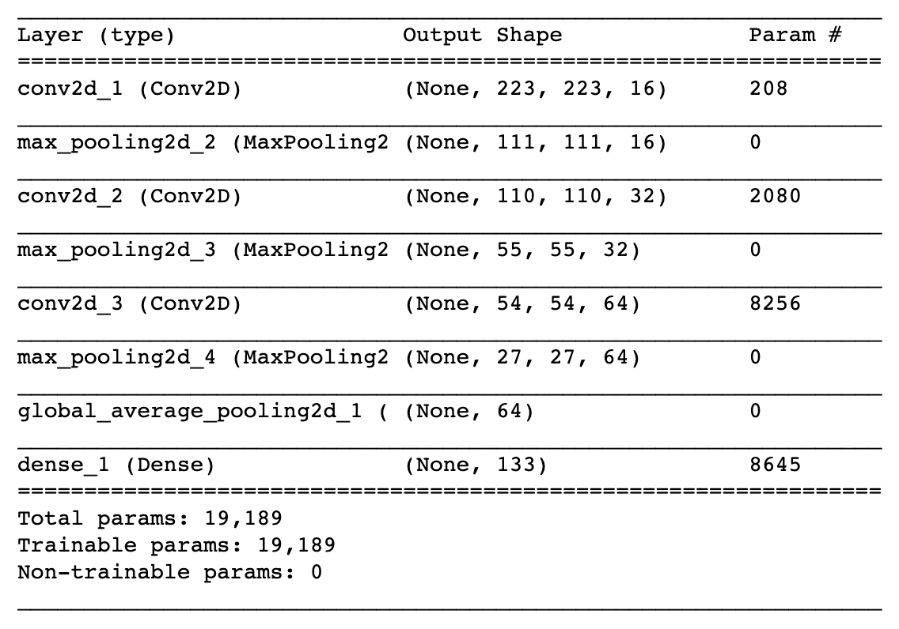
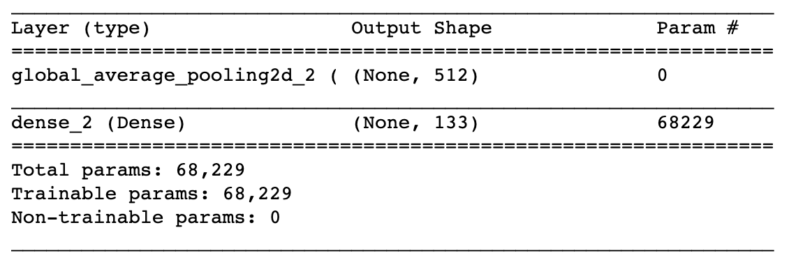
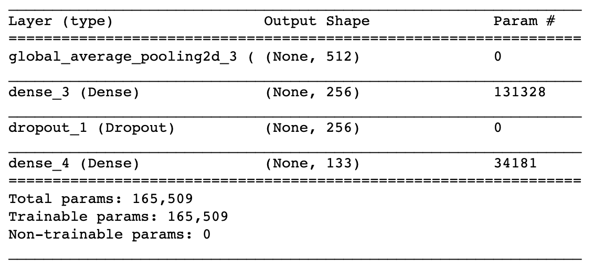

# Dog Breed Classifier with Deep Learning

## Introduction

This project is about preparing a classifier allowing dogs and humans recognition. Given an image of a dog, the algorithm identifies an estimate of the dog's breed. If supplied an image of a human, the code identifies the resembling dog breed.

I define and train Convolutional Neural Networks (CNNs) using transfer learning, a technique that allows a model developed for a task to be reused as the starting point for another task. CNN network architecture is a specialized setup of interconnected neural network layers used in visal data analysis. CNN model typically consists of convolutional layers, activation function, pooling layers, fully connected layers and normalization layers.

This project was completed as part of Udacity's [Data Scientist Nanodegree](https://eu.udacity.com/course/data-scientist-nanodegree--nd025) certification.

## Objective

The objective of this project is trainining an image classifier to recognize different breeds of dogs, then export it for use in a stand alone application.

The purpose of this article is to descibe technical steps and their outcome from start to finish.

## Project Instructions

In order to setup everything to get started, you can follow [the Project Instructions](README.md).

## Approach

The approach I take to fulfill our objective can be represented by the following list of steps:

- Step 1: Import Datasets
- Step 2: Detect Humans
- Step 3: Detect Dogs
- Step 4: Create a CNN to Classify Dog Breeds (baseline)
- Step 5: Use a CNN to Classify Dog Breeds (using Transfer Learning)
- Step 6: Create a CNN to Classify Dog Breeds (using Transfer Learning)
- Step 7: Write Your Algorithm
- Step 8: Test Your Algorithm

In order to achieve the objective, I piece together a series of models to perform different tasks (an algorithm that detects humans or dogs in an image, and CNN that infers dog breed).

## Step 1: Import Datasets

The first step is importing dog and human image datasets. I populate a few variables through the use of the `load_files` function from the scikit-learn library:

- `train_files`, `valid_files`, `test_files` - numpy arrays containing file paths to images,
- `train_targets`, `valid_targets`, `test_targets` - numpy arrays containing onehot-encoded classification labels,
- `dog_names` - list of string-valued dog breed names for translating labels.

There are 8351 total dog images in 133 breed categories. For modeling purposes, I divide the dataset into three sub-datasets:
 
- training (6680 dog images),
- validation (835 dog images),
- test (836 dog images).

There are 33 to 96 dog images in each category with the mean of 63 dog images per category.


The imported dataset of paths to human images, are stored in the numpy array `human_files`.

## Step 2: Detect Humans

Once the datasets are ready, I focus on a function to detect whether a human face exists in an image. I use OpenCV's implementation of Haar feature-based cascade classifiers to detect human faces in images. OpenCV provides many pre-trained face detectors, stored as XML files on github. I have downloaded one of these detectors and stored it in the haarcascades directory.

```
import cv2                                              

# extract pre-trained face detector
face_cascade = cv2.CascadeClassifier('haarcascades/haarcascade_frontalface_alt.xml')

# load color (BGR) image
img = cv2.imread(human_files[30])

# convert BGR image to grayscale
gray = cv2.cvtColor(img, cv2.COLOR_BGR2GRAY)

# find faces in image
faces = face_cascade.detectMultiScale(gray)

# print number of faces detected in the image
print('Number of faces detected:', len(faces))

# get bounding box for each detected face
for (x,y,w,h) in faces:
    
# add bounding box to color image
cv2.rectangle(img,(x,y),(x+w,y+h),(255,0,0),2)
    
# convert BGR image to RGB for plotting
cv_rgb = cv2.cvtColor(img, cv2.COLOR_BGR2RGB)

# display the image, along with bounding box
plt.imshow(cv_rgb)
plt.show()
```



Before using any of the face detectors, it is standard procedure to convert the images to grayscale. The `detectMultiScale` function executes the classifier stored in `face_cascade` and takes the grayscale image as a parameter.

In the above code, `faces` is a numpy array of detected faces, where each row corresponds to a detected face. Each detected face is a 1D array with four entries that specifies the bounding box of the detected face. The first two entries in the array (extracted in the above code as `x` and `y`) specify the horizontal and vertical positions of the top left corner of the bounding box. The last two entries in the array (extracted here as `w` and `h`) specify the width and height of the box.

I use this procedure to write a function that returns `True` if a human face is detected in an image or `False` otherwise. This function, aptly named `face_detector`, takes a string-valued file path to an image as input and appears in the code block below.

```
# returns "True" if face is detected in image stored at img_path
def face_detector(img_path):
    img = cv2.imread(img_path)
    gray = cv2.cvtColor(img, cv2.COLOR_BGR2GRAY)
    faces = face_cascade.detectMultiScale(gray)
    return len(faces) > 0
```
The function, tested on 100 human and 100 dog images, recognized 100% human faces in images comming from humans dataset and wrongly 11% human faces in images comming from the dog dataset (this number should be 0%).

Although not explicitely needed in our example, I could improve human faces recognition by adding more pictures as a result of visual transformations of the core dataset to make sure the dataset can cover some 'non standard' face presentations (like skewed or mirrored ones, etc.).

## Step 3: Detect Dogs

I use pre-trained ResNet-50 model to detect dogs in images. 

```
from keras.applications.resnet50 import ResNet50

# define ResNet50 model
ResNet50_model = ResNet50(weights='imagenet')
```

The first line of code downloads the ResNet-50 model, along with weights that have been trained on ImageNet, a very large, very popular dataset used for image classification and other vision tasks. ImageNet contains over 10 million URLs, each linking to an image containing an object from one of 1000 categories. 

Given an image, this pre-trained ResNet-50 model returns a prediction (derived from the available categories in ImageNet) for the object that is contained in the image.

When using TensorFlow as backend, Keras CNNs require a 4D array (which we'll also refer to as a 4D tensor) as input, with shape `(nb_samples,rows,columns,channels)`,  
where `nb_samples` corresponds to the total number of images (or samples), and `rows`, `columns`, and `channels` correspond to the number of rows, columns, and channels for each image, respectively.

The `path_to_tensor` function below takes a string-valued file path to a color image as input and returns a 4D tensor suitable for supplying to a Keras CNN.

```
from keras.preprocessing import image                  
from tqdm import tqdm

def path_to_tensor(img_path):
    # loads RGB image as PIL.Image.Image type
    img = image.load_img(img_path, target_size=(224, 224))
    # convert PIL.Image.Image type to 3D tensor with shape (224, 224, 3)
    x = image.img_to_array(img)
    # convert 3D tensor to 4D tensor with shape (1, 224, 224, 3) and return 4D tensor
    return np.expand_dims(x, axis=0)
```
The `paths_to_tensor `function takes a numpy array of string-valued image paths as input and returns a 4D tensor with shape `(nb_samples,224,224,3)`.
 
Here, `nb_samples` is the number of samples, or number of images, in the supplied array of image paths. 

```
def paths_to_tensor(img_paths):
    list_of_tensors = [path_to_tensor(img_path) for img_path in tqdm(img_paths)]
    return np.vstack(list_of_tensors)
```

The `ResNet50_predict_labels` function makes predictions with ResNet-50.

```
from keras.applications.resnet50 import preprocess_input, decode_predictions

def ResNet50_predict_labels(img_path):
    # returns prediction vector for image located at img_path
    img = preprocess_input(path_to_tensor(img_path))
    return np.argmax(ResNet50_model.predict(img))
```

Getting the 4D tensor ready for ResNet-50, and for any other pre-trained model in Keras, requires some additional processing. First, the RGB image is converted to BGR by reordering the channels. All pre-trained models have the additional normalization step that the mean pixel (expressed in RGB as [103.939,116.779,123.68] and calculated from all pixels in all images in ImageNet) must be subtracted from every pixel in each image. This is implemented in the imported function `preprocess_input`. 

Now that I have a way to format our image for supplying to ResNet-50, I am now ready to use the model to extract the predictions. This is accomplished with the `predict` method, which returns an array whose i-th entry is the model's predicted probability that the image belongs to the i-th ImageNet category.

By taking the `argmax` of the predicted probability vector, I obtain an integer corresponding to the model's predicted object class, which we can identify with an object category through the use of [this dictionary](https://gist.github.com/yrevar/942d3a0ac09ec9e5eb3a).

While looking at the dictionary, I can notice that the categories corresponding to dogs appear in an uninterrupted sequence and correspond to dictionary keys 151-268, inclusive, to include all categories from 'Chihuahua' to 'Mexican hairless'. Thus, in order to check to see if an image is predicted to contain a dog by the pre-trained ResNet-50 model, I need only check if the `ResNet50_predict_labels` function above returns a value between 151 and 268 (inclusive).

I use these ideas to complete the `dog_detector` function below, which returns `True` if a dog is detected in an image (or `False` if not).

```
### returns "True" if a dog is detected in the image stored at img_path
def dog_detector(img_path):
    prediction = ResNet50_predict_labels(img_path)
    return ((prediction <= 268) & (prediction >= 151)) 
```

The code below tests the performance of my `dog_detector` function.

```
detected_human_faces = 0
detected_dog_faces = 0

for i in range(100):
    if dog_detector(human_files_short[i]):
        detected_human_faces += 1
    if dog_detector(dog_files_short[i]):
        detected_dog_faces +=1
```
The dog detector's performance is better than the human detector as it identifies 0 dogs in human dataset and 100% dogs in the dog dataset.

## Step 4: Create a CNN to Classify Dog Breeds 

Now, that I have functions for detecting humans and dogs in images, I need a way to predict breed from images. In this step, I create a CNN that classifies dog breeds.

First, I rescale the images by dividing every pixel in every image by 255.

```
from PIL import Image, ImageFile                            
ImageFile.LOAD_TRUNCATED_IMAGES = True                 

# pre-process the data for Keras
train_tensors = paths_to_tensor(train_files).astype('float32')/255
valid_tensors = paths_to_tensor(valid_files).astype('float32')/255
test_tensors = paths_to_tensor(test_files).astype('float32')/255
```

Then, I create a CNN to classify dog's breed. At the end of the below code block, I summarize the layers of your model by executing the line: `model.summary()`.

```
from keras.layers import Conv2D, MaxPooling2D, GlobalAveragePooling2D
from keras.layers import Dropout, Flatten, Dense
from keras.models import Sequential

model = Sequential()

### TODO: Define your architecture.

model.add(Conv2D(filters=16, kernel_size=2,input_shape=(224, 224, 3)))
model.add(MaxPooling2D(pool_size=2))
model.add(Conv2D(filters=32, kernel_size=2,input_shape=(111, 111, 32)))
model.add(MaxPooling2D(pool_size=2))
model.add(Conv2D(filters=64, kernel_size=2,input_shape=(55, 55, 64)))
model.add(MaxPooling2D(pool_size=2))
model.add(GlobalAveragePooling2D())
model.add(Dense(133, activation="softmax"))

model.summary()
```
Below, there is the resulting CNN architecture. This architecture and corresponding model acts as a baseline for improvement. This architecture is proposed by Udacity as a fast CPU-optimized one.



Once the architecture is defined, I compile a model and train it. I use model checkpointing to save the model that attains the Best Validation Loss.

```
model.compile(optimizer='rmsprop', loss='categorical_crossentropy', metrics=['accuracy'])

from keras.callbacks import ModelCheckpoint  

epochs = 5

checkpointer = ModelCheckpoint(filepath='saved_models/weights.best.from_scratch.hdf5', 
                               verbose=1, save_best_only=True)

model.fit(train_tensors, train_targets, 
          validation_data=(valid_tensors, valid_targets),
          epochs=epochs, batch_size=20, callbacks=[checkpointer], verbose=1)
```
After training, I load the model with the Best Validation Loss and try out my new model on the test dataset of dog images.

```
model.load_weights('saved_models/weights.best.from_scratch.hdf5')

# get index of predicted dog breed for each image in test set
dog_breed_predictions = [np.argmax(model.predict(np.expand_dims(tensor, axis=0))) for tensor in test_tensors]

# report test accuracy
test_accuracy = 100*np.sum(np.array(dog_breed_predictions)==np.argmax(test_targets, axis=1))/len(dog_breed_predictions)
```
**The acquired test accuracy of this baseline model is 1.9139%.**

The full dataset has only 8351 dog images, which is not large enough to train a deep learning model from scratch. That is why trying transfer learning technique is our next step.

## Step 5: Use a CNN to Classify Dog Breeds (using Transfer Learning)

To reduce training time without sacrificing accuracy, I  train a CNN using transfer learning.

I obtain bottleneck features and then define a simple architecture for the the network.

```
bottleneck_features = np.load('bottleneck_features/DogVGG16Data.npz')
train_VGG16 = bottleneck_features['train']
valid_VGG16 = bottleneck_features['valid']
test_VGG16 = bottleneck_features['test']

VGG16_model = Sequential()
VGG16_model.add(GlobalAveragePooling2D(input_shape=train_VGG16.shape[1:]))
VGG16_model.add(Dense(133, activation='softmax'))

VGG16_model.summary()
```


Next, I compile and train the new model.

```
VGG16_model.compile(loss='categorical_crossentropy', optimizer='rmsprop', metrics=['accuracy'])

checkpointer = ModelCheckpoint(filepath='saved_models/weights.best.VGG16.hdf5', 
                               verbose=1, save_best_only=True)

VGG16_model.fit(train_VGG16, train_targets, 
          validation_data=(valid_VGG16, valid_targets),
          epochs=20, batch_size=20, callbacks=[checkpointer], verbose=1)
```

Now, I can load the new model with the Best Validation Loss and test it on how well it identifies breed within our test dataset of dog images.

```
VGG16_model.load_weights('saved_models/weights.best.VGG16.hdf5')

# report test accuracy
test_accuracy = 100*np.sum(np.array(VGG16_predictions)==np.argmax(test_targets, axis=1))/len(VGG16_predictions)
```
**The test accuracy of the new model is 42.9426%.** This is a huge improvement.

## Step 6: Create a CNN to Classify Dog Breeds (using Transfer Learning)

Encouraged by the latest results, I try to improve our model by testing different bottleneck features and network architectures. My goal here is to achieve at least 60% accuracy on the test set.

To achieve the goal, we use the bottleneck features from a different pre-trained model VGG-19 (provided by Udacity) and add two additional layers to my previous architecture.

```
bottleneck_features = np.load('bottleneck_features/DogVGG19Data.npz')
train_VGG19 = bottleneck_features['train']
valid_VGG19 = bottleneck_features['valid']
test_VGG19 = bottleneck_features['test']

VGG19_model = Sequential()
VGG19_model.add(GlobalAveragePooling2D(input_shape=train_VGG19.shape[1:]))
VGG19_model.add(Dense(256, activation='relu'))
VGG19_model.add(Dropout(0.2))
VGG19_model.add(Dense(133, activation='softmax'))

VGG19_model.summary()
```

As a result, I get the architecture where the last convolutional output of VGG-19 acts as input to my model. As dog classifiers, I add a global average pooling layer, two fully connected layers (for better accuracy) and dropout layer (to prevent over-fitting).



I compile and train the model in the same way as before.

```
VGG19_model.compile(loss='categorical_crossentropy', optimizer='rmsprop', metrics=['accuracy'])

checkpointer = ModelCheckpoint(filepath='saved_models/weights.best.VGG19.hdf5', 
                               verbose=1, save_best_only=True)

VGG19_model.fit(train_VGG19, train_targets, 
          validation_data=(valid_VGG19, valid_targets),
          epochs=20, batch_size=20, callbacks=[checkpointer], verbose=1)
```

And test its performance using accuracy as a metric (the data is only a little bit imbalanced, so accuracy seems to be a proper metric to select a good model).

```
# Load the model weights with the best validation loss.

VGG19_model.load_weights('saved_models/weights.best.VGG19.hdf5')

# get index of predicted dog breed for each image in test set
VGG19_predictions = [np.argmax(VGG19_model.predict(np.expand_dims(feature, axis=0))) for feature in test_VGG19]

# report test accuracy
test_accuracy = 100*np.sum(np.array(VGG19_predictions)==np.argmax(test_targets, axis=1))/len(VGG19_predictions)
```

**This time, the test accuracy is 72.7273%, almost two times more than before and about 36 times better than our base model (without transfer learning).**

I define a `VGG19_predict_breed` function to be used later for predictions. The function takes an image path as input, and returns the predicted dog breeds.

```
def VGG19_predict_breed(img_path):
    # extract bottleneck features
    bottleneck_feature = extract_VGG19(path_to_tensor(img_path))
    # obtain predicted vector
    predicted_vector = VGG19_model.predict(bottleneck_feature)
    # return dog breed that is predicted by the model
    return dog_names[np.argmax(predicted_vector)]
```

## Step 7: Write Your Algorithm

This step is to write an algorithm that accepts a file path to an image and first determines whether the image contains a human, dog, or neither. Then,

- if a dog is detected in the image, return the predicted breed,
- if a human is detected in the image, return the resembling dog breed,
- if neither is detected in the image, provide output that indicates an error.

Below, there is `detector` function implementing the algorithm and a helper funtion `show_image` to display images.

```
def show_image(img_path, title="Title"):
    image = Image.open(img_path)
    plt.title(title)
    plt.imshow(image)
    plt.show()

def detector(img_path):
    
    # If the image contains human faces:
    if (face_detector(img_path)):
        print("Hello Human!")
        #predicted_breed = VGG16_predict_breed(img_path)
        predicted_breed = VGG19_predict_breed(img_path)
        show_image(img_path, title=f"Predicted:{predicted_breed}")
        
        print("You look like a ...")
        print(predicted_breed.upper())
    
    # If the image contain a dog:
    elif dog_detector(img_path):
        print("Hello Dog!")
        #predicted_breed = VGG16_predict_breed(img_path)
        predicted_breed = VGG19_predict_breed(img_path)
        show_image(img_path, title=f"Predicted:{predicted_breed}")
        
        print("Your breed should be ...")
        print(predicted_breed.upper())
        
    else:
        print("I couldn't detect any dog or human face in the image.")
        show_image(img_path, title="...")
        print("Try with another image!")
    print("\n\n")
```
## Step 8: Test Your Algorithm

Now, I can test my best predictor choosing randomly (function `randint`) `number_of_examples` images from human and dog datasets.

```
from random import randint

dog_files = np.hstack([train_files, valid_files, test_files])

number_of_examples = 3

for i in range(number_of_examples):
    detector(human_files[randint(0, len(dog_files))])
    
for i in range(number_of_examples):
    detector(dog_files[randint(0, len(dog_files))])
```

The output of the `detector` function looks quite good, nevertheless I can see some possible **areas of improvement**:

- Adding more images for training, also images augmentation could help in result improvement,
- Playing with hyper-parameters, like learning rate or batch_size could help,
- Using other CNN archietectures could also have positive impact.

## Conclusion

The above example of using CCNs and transfer learning showed the power of transfer learning where with a relatively small dataset and pre-computed bottleneck features from a pre-trained model I was able to achieve pretty good accuracy in a short period of time needed for training a network.

The initial, baseline model had accuracy of 1.9139%, whereas the last one 72.7273% which is a quite significant improvement.
